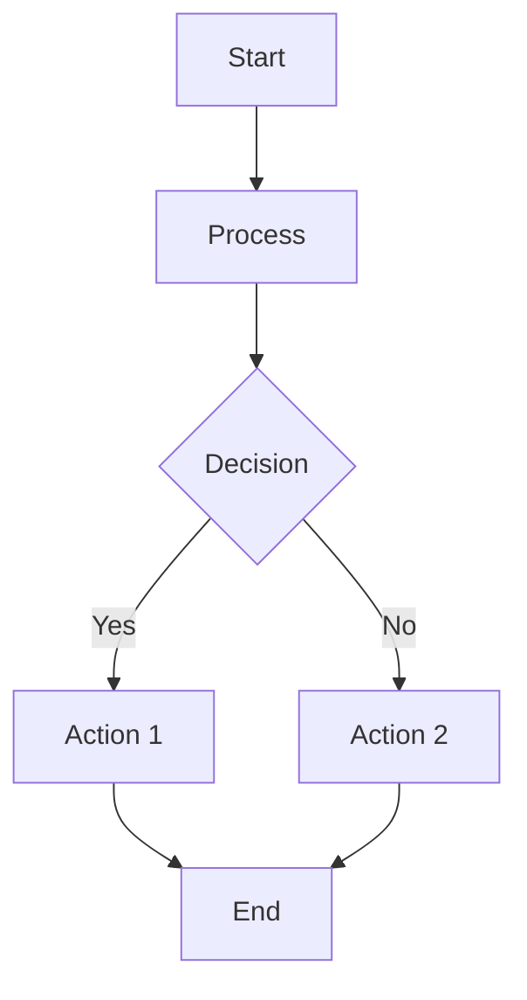
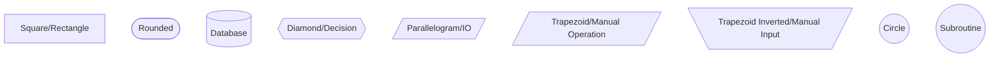
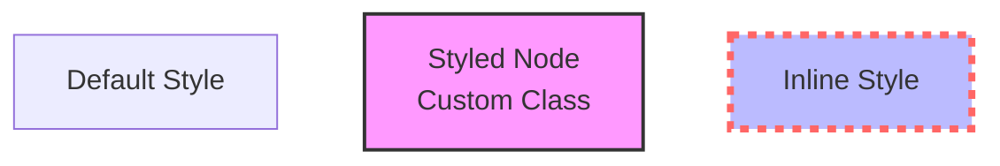
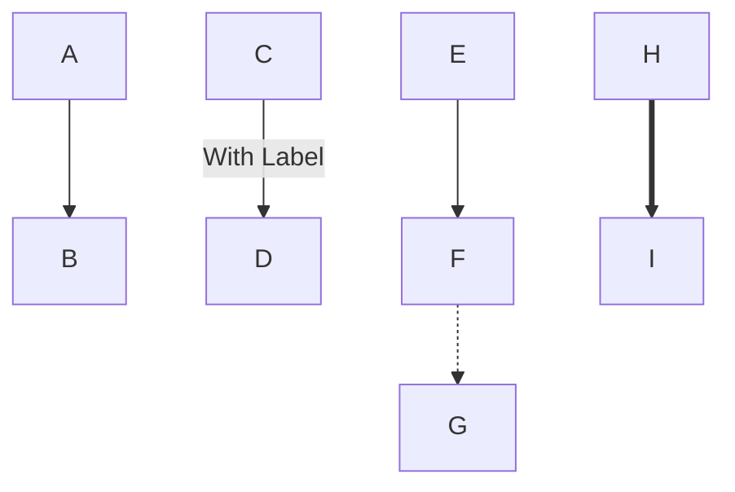
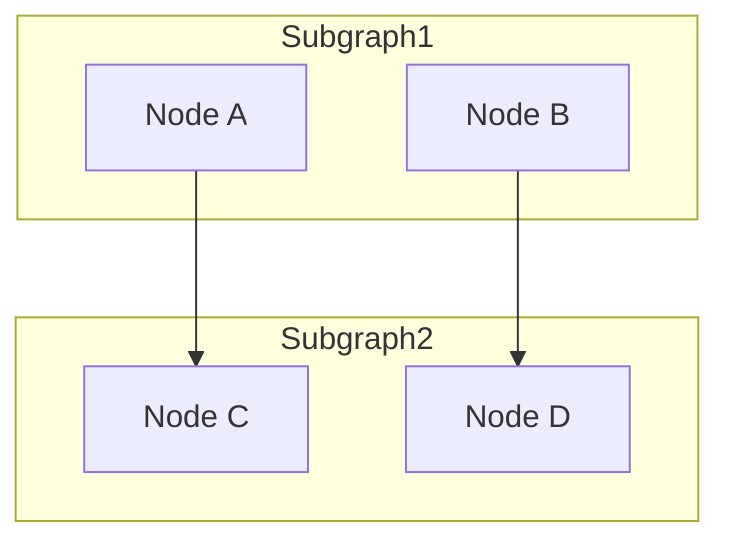
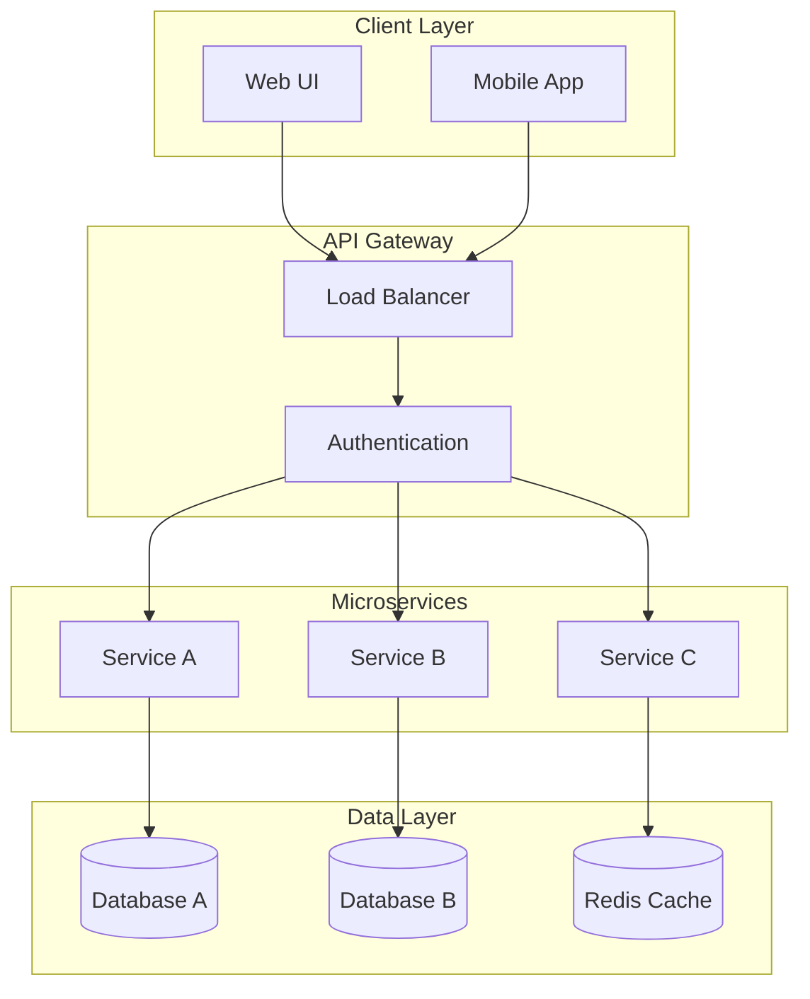
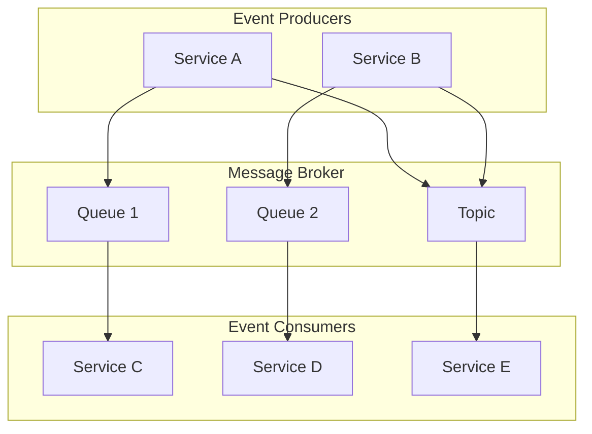
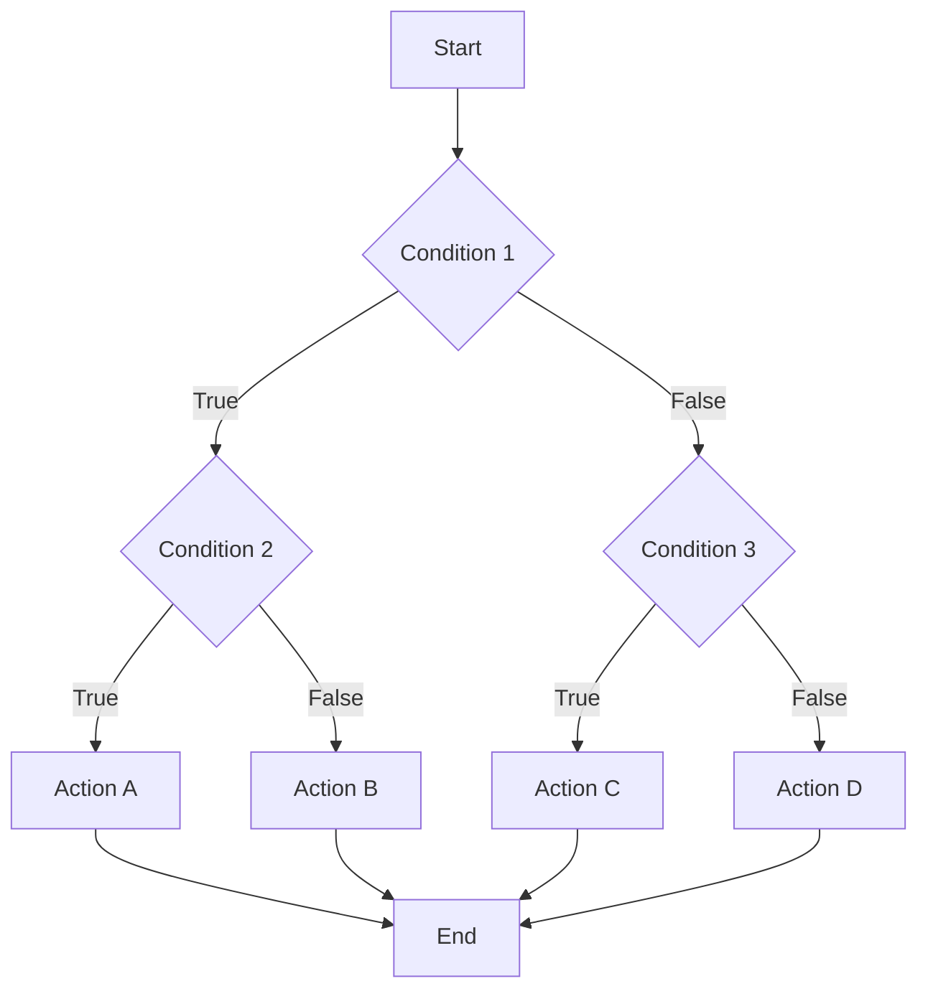
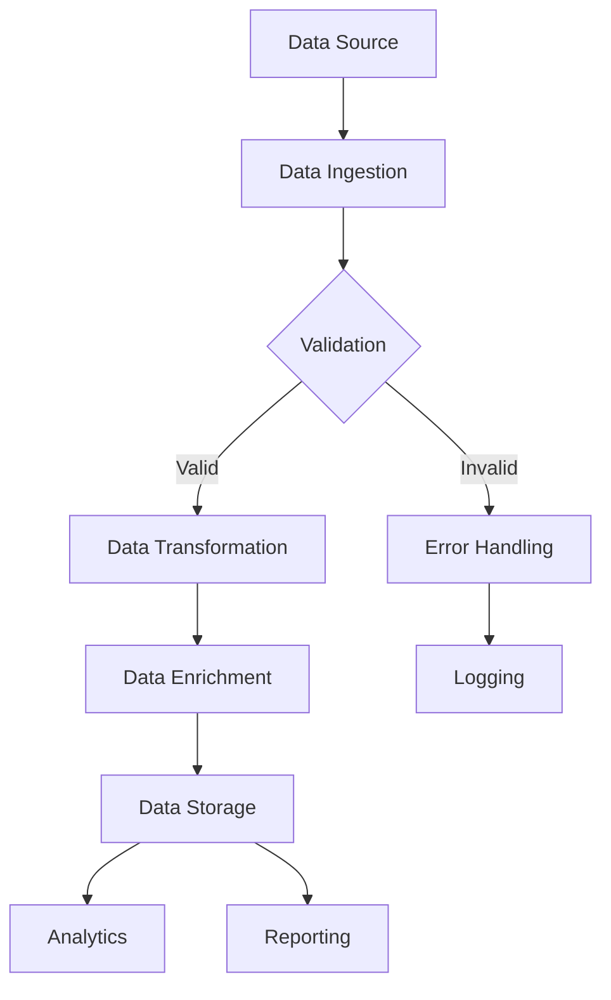

# Mermaid Flowchart Creation and Editing

## Overview

This skill enables creating and editing technical architecture flowcharts, system diagrams, and process flow diagrams using Mermaid syntax. Mermaid is a powerful diagramming and charting tool that uses text definitions to create diagrams.

## When to Use This Skill

Use this skill when you need to:
- Create system architecture diagrams
- Design process flow diagrams
- Visualize data flow
- Document technical workflows
- Create decision trees
- Design organizational structures
- Map out dependencies between components

## Mermaid Flowchart Syntax

### Basic Structure



### Direction Options

- `TD` - Top to Bottom (default)
- `TB` - Top to Bottom (same as TD)
- `BT` - Bottom to Top
- `LR` - Left to Right
- `RL` - Right to Left

### Node Shapes



### Node Styling



### Connections and Labels



### Subgraphs



## Architecture Diagram Patterns

### Microservices Architecture



### Three-Tier Architecture

```mermaid
flowchart TD
    subgraph Presentation["Presentation Layer"]
        Web[Web Application]
        MobileApp[Mobile Application]
    end

    subgraph Business["Business Logic Layer"]
        API[API Server]
        Auth[Authentication Service]
        Business[Business Logic]
    end

    subgraph Data["Data Access Layer"]
        ORM[ORM/DAO]
        Cache[Cache Layer]
    end

    subgraph Storage["Storage Layer"]
        SQL[(SQL Database)]
        NoSQL[(NoSQL Database)]
        File[File Storage]
    end

    Web --> API
    MobileApp --> API
    API --> Auth
    API --> Business
    Business --> ORM
    Business --> Cache
    ORM --> SQL
    ORM --> NoSQL
    Cache --> SQL
    Cache --> NoSQL
    Business --> File
```

### Event-Driven Architecture



## Process Flow Patterns

### Decision Tree



### Data Pipeline



## Best Practices

### Design Principles

1. **Keep it simple**: Avoid overcomplicating diagrams with too many nodes
2. **Use consistent styling**: Apply uniform colors and shapes for similar elements
3. **Logical grouping**: Use subgraphs to organize related components
4. **Clear labels**: Use descriptive, concise labels for nodes and connections
5. **Appropriate direction**: Choose TD or LR based on the diagram's natural flow

### Color Schemes

Use these recommended color schemes for professional diagrams:

**Blue Theme (Technology)**:
- Primary: `#3498db` (Blue)
- Secondary: `#2980b9` (Dark Blue)
- Accent: `#e74c3c` (Red)
- Background: `#ecf0f1` (Light Gray)

**Green Theme (Success/Process)**:
- Primary: `#27ae60` (Green)
- Secondary: `#2ecc71` (Light Green)
- Accent: `#f39c12` (Orange)
- Background: `#f5f6fa` (Very Light Gray)

**Purple Theme (Architecture)**:
- Primary: `#9b59b6` (Purple)
- Secondary: `#8e44ad` (Dark Purple)
- Accent: `#3498db` (Blue)
- Background: `#f4ecf7` (Light Purple)

### Node Naming Conventions

- Use descriptive names: `UserService` instead of `Service1`
- Use consistent capitalization: `PascalCase` or `camelCase`
- Include type hints when helpful: `UserDatabase[(DB)]`
- Use abbreviations consistently: `API` not `Api`

## Workflow

1. **Understand requirements**: Clarify what the diagram should represent
2. **Identify components**: List all nodes and their relationships
3. **Choose structure**: Select appropriate direction and layout
4. **Draft diagram**: Create initial Mermaid code
5. **Apply styling**: Add colors, shapes, and labels
6. **Validate**: Review for clarity and accuracy
7. **Iterate**: Refine based on feedback

## Rendering

To render Mermaid diagrams:
- Use the Mermaid Live Editor: https://mermaid.live
- Use Mermaid CLI: `mmdc -i input.mmd -o output.png`
- Integrate with documentation tools (GitHub, GitLab, Notion, etc.)

## Common Issues and Solutions

### Diagram Too Complex
- Break into multiple smaller diagrams
- Use subgraphs to organize
- Remove unnecessary detail

### Overlapping Nodes
- Adjust direction (TD vs LR)
- Increase spacing with custom styles
- Simplify connections

### Poor Readability
- Use larger fonts
- Improve color contrast
- Add more descriptive labels
- Reduce node count

## Dependencies

Required tools:
- **Mermaid CLI**: `npm install -g @mermaid-js/mermaid-cli`
- **Node.js**: Required for Mermaid CLI
