# Mermaid Sequence Diagram Creation and Editing

## Overview

This skill enables creating and editing sequence diagrams, interaction diagrams, and message flow diagrams using Mermaid syntax. Sequence diagrams show how objects interact in a given scenario, focusing on the order of message exchange.

## When to Use This Skill

Use this skill when you need to:
- Document API interactions
- Visualize system communication flows
- Design protocol handshakes
- Map out request/response cycles
- Document authentication flows
- Design error handling scenarios
- Visualize async/sync operations

## Mermaid Sequence Diagram Syntax

### Basic Structure

### Participants

### Message Types

### Self-Calls and Loops

### Alt and Opt Blocks

### Par and Critical Sections

### Notes and Comments

## Common Sequence Diagram Patterns

### REST API Request Flow

### Authentication Flow (OAuth2)

### Database Transaction Flow

### Message Queue Processing

### WebSocket Communication

### Error Handling Flow

### Async Event Processing

## Styling and Customization

### Participant Styling

```mermaid
sequenceDiagram
    autonumber
    actor User as 👤 User
    participant Client as 📱 Client
    participant Server as 🖥️ Server
    participant Database as 🗄️ Database

    User->>Client: Action
    Client->>Server: Request
    Server->>Database: Query
    Database-->>Server: Data
    Server-->>Client: Response
    Client-->>User: Result
```

### Activation Boxes

### Box and Rect

## Best Practices

### Design Principles

1. **Clear participants**: Use descriptive names for all participants
2. **Logical flow**: Arrange participants left-to-right in order of interaction
3. **Appropriate detail**: Include only relevant messages and steps
4. **Consistent naming**: Use consistent naming conventions
5. **Error handling**: Include alt/opt blocks for error scenarios

### Message Naming

- Use verb-noun format: `getUserData`, `updateRecord`
- Be descriptive but concise: `validateCredentials` not `checkIfTheUserCredentialsAreValid`
- Include response status in returns: `returnSuccess`, `returnError`

### When to Use Each Message Type

- `->>`: Synchronous request (wait for response)
- `-->`: Asynchronous message (fire and forget)
- `-->>`: Return message (response to synchronous request)
- `->`: Direct message (no response expected)
- `--`: Return message (no arrowhead)

### Organization Tips

- Use `autonumber` for complex diagrams
- Group related operations with `loop`, `alt`, `opt`
- Use `par` for concurrent operations
- Add notes to explain complex sections
- Use `box` to group related participants

## Workflow

1. **Identify participants**: List all systems/objects involved
2. **Determine interactions**: Map out message exchanges
3. **Choose message types**: Select appropriate arrow styles
4. **Add control structures**: Use alt/opt/par/loop as needed
5. **Add annotations**: Include notes for clarity
6. **Review and refine**: Check for completeness and clarity
7. **Validate**: Ensure diagram accurately represents the flow

## Rendering

To render Mermaid sequence diagrams:
- Use the Mermaid Live Editor: https://mermaid.live
- Use Mermaid CLI: `mmdc -i input.mmd -o output.png`
- Integrate with documentation tools (GitHub, GitLab, Notion, etc.)

## Common Issues and Solutions

### Diagram Too Wide
- Reduce number of participants
- Use shorter participant names
- Consider breaking into multiple diagrams

### Too Many Messages
- Group related messages
- Use sub-diagrams for complex flows
- Hide implementation details

### Confusing Flow
- Add autonumbering
- Use notes to explain sections
- Simplify message names
- Break into multiple diagrams

### Missing Error Handling
- Add alt blocks for error cases
- Include timeout scenarios
- Document retry logic

## Dependencies

Required tools:
- **Mermaid CLI**: `npm install -g @mermaid-js/mermaid-cli`
- **Node.js**: Required for Mermaid CLI
