# Mermaid.js Practical Examples

Real-world patterns and use cases for common documentation scenarios.

## Software Architecture

**Microservices Architecture:**
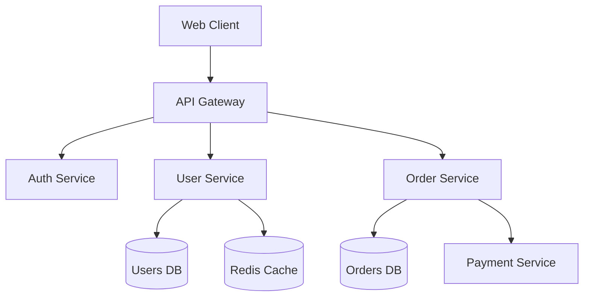

**Vertical Module Architecture:**
模块垂直分布，模块内元素水平分布，无连接线。
```mermaid
block-beta
  columns 3
  
  subgraph "前端层"
    WebApp[Web应用] API[API网关] CDN[CDN]
  end
  
  subgraph "业务层"
    ServiceA[服务A] ServiceB[服务B] ServiceC[服务C]
  end
  
  subgraph "数据层"
    DB[数据库] Cache[缓存] Storage[存储]
  end
```

**Complex Vertical Architecture:**
不同模块包含不同数量的元素。
```mermaid
block-beta
  columns 4
  
  subgraph "接入层"
    Nginx[Nginx] CDN[CDN] WAF[WAF] LB[负载均衡]
  end
  
  subgraph "服务层"
    Auth[认证服务] User[用户服务] Order[订单服务]
  end
  
  subgraph "中间件层"
    Redis[Redis] Kafka[Kafka] ES[Elasticsearch]
  end
  
  subgraph "数据层"
    MySQL[MySQL] MongoDB[MongoDB] MinIO[MinIO]
  end
  
  subgraph "基础设施层"
    K8s[Kubernetes] Docker[Docker] CI[CI/CD]
  end
```

**Styled Vertical Architecture:**
带自定义样式的垂直模块架构。
```mermaid
block-beta
  columns 3
  classDef moduleStyle fill:#f0f4f8,stroke:#2563eb,stroke-width:2px,rx:5px
  classDef elementStyle fill:#dbeafe,stroke:#1d4ed8,stroke-width:1px,rx:3px
  classDef dbStyle fill:#fef3c7,stroke:#d97706,stroke-width:1px,rx:3px
  classDef cacheStyle fill:#d1fae5,stroke:#059669,stroke-width:1px,rx:3px
  
  subgraph "前端层":::moduleStyle
    WebApp[Web应用]:::elementStyle API[API网关]:::elementStyle CDN[CDN]:::elementStyle
  end
  
  subgraph "业务层":::moduleStyle
    ServiceA[服务A]:::elementStyle ServiceB[服务B]:::elementStyle ServiceC[服务C]:::elementStyle
  end
  
  subgraph "数据层":::moduleStyle
    MySQL[MySQL]:::dbStyle Redis[Redis]:::cacheStyle Storage[存储]:::elementStyle
  end
```

**System Components (C4):**
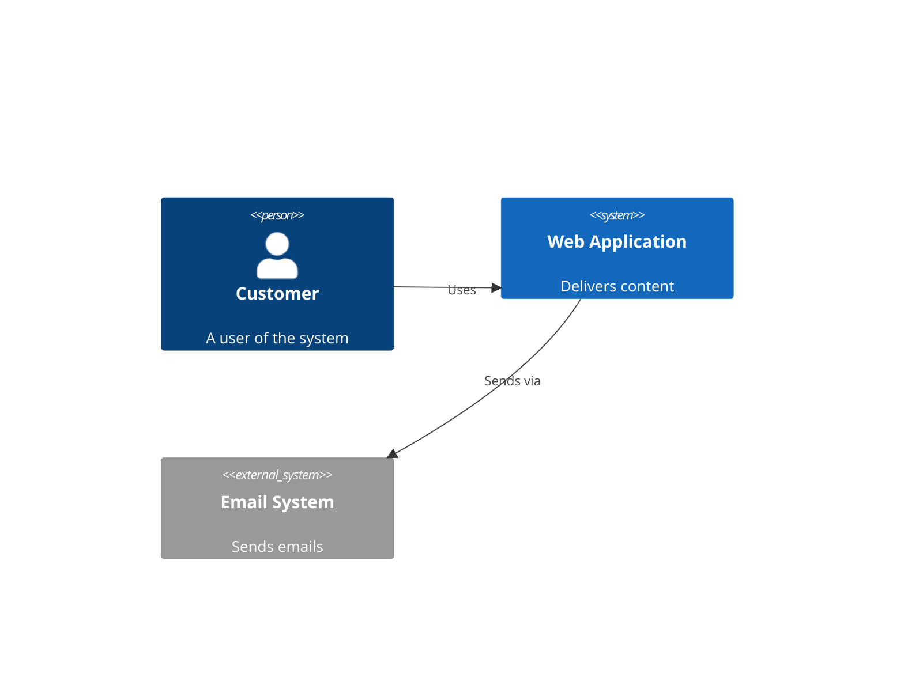

## API Documentation

**Authentication Flow:**
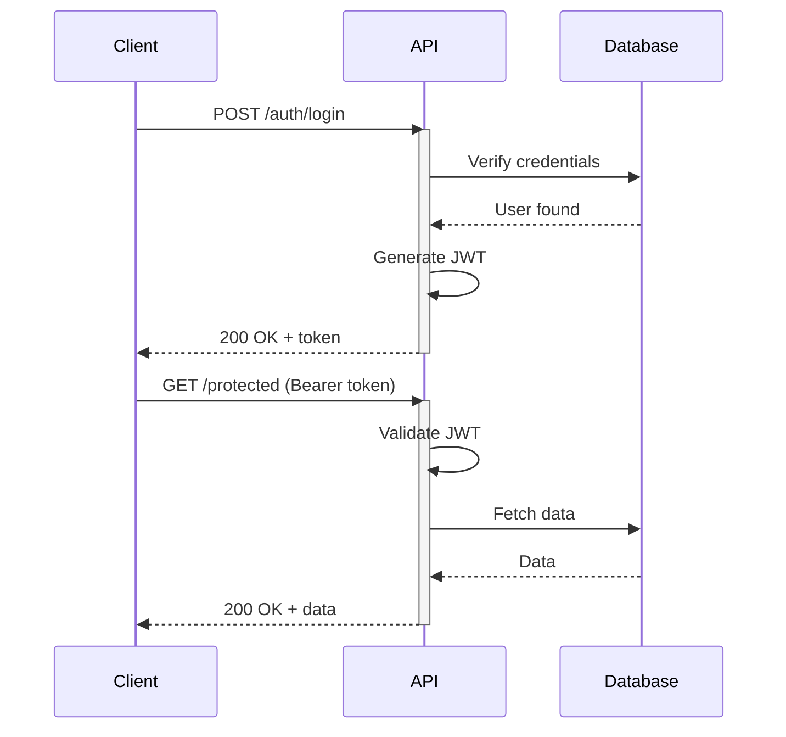

**REST API Endpoints:**
```mermaid
flowchart LR
  API[API]
  Users[/users]
  Posts[/posts]
  Comments[/comments]

  API --> Users
  API --> Posts
  API --> Comments

  Users --> U1[GET /users]
  Users --> U2[POST /users]
  Users --> U3[GET /users/:id]
  Users --> U4[PUT /users/:id]
  Users --> U5[DELETE /users/:id]
```

## Database Design

**E-Commerce Schema:**
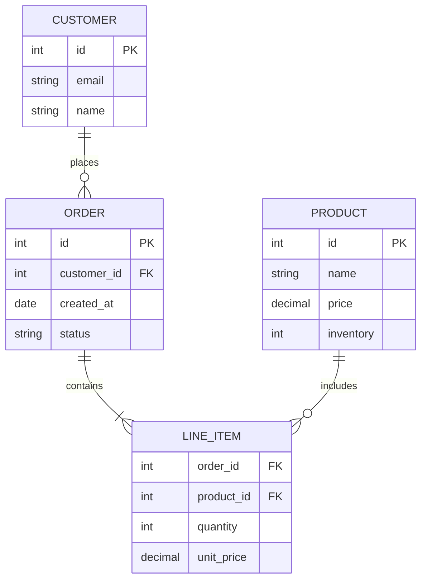

## State Machines

**Order Processing:**
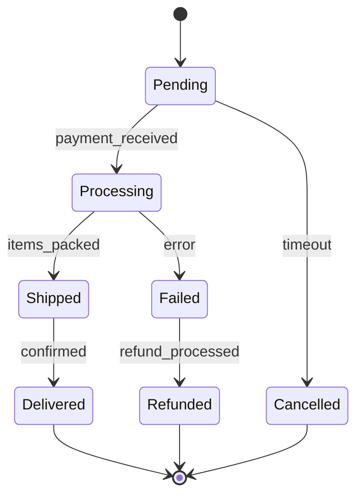

**User Authentication States:**
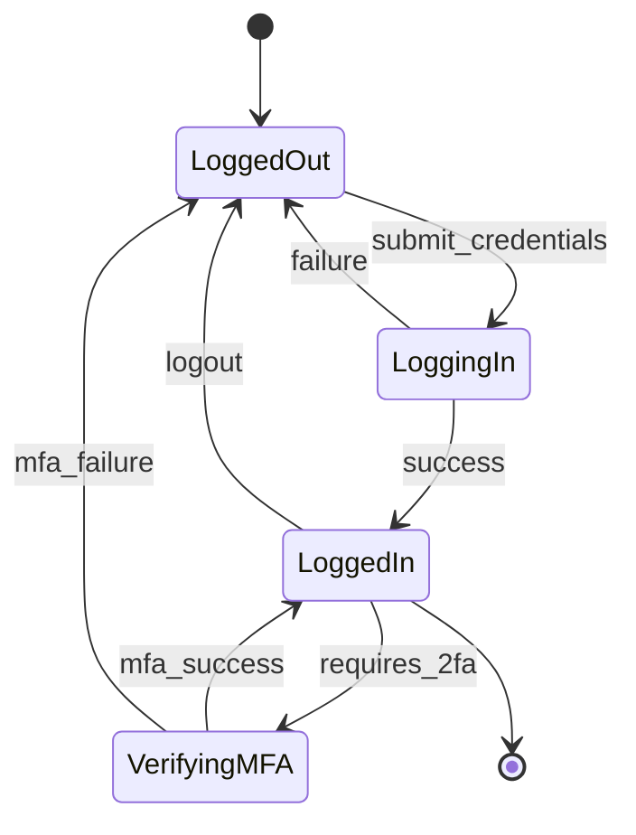

## Project Planning

**Sprint Timeline:**
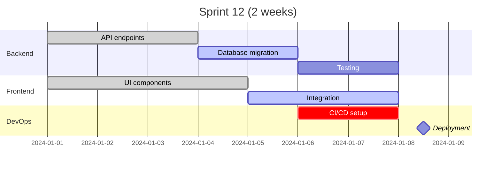

**Feature Development Journey:**
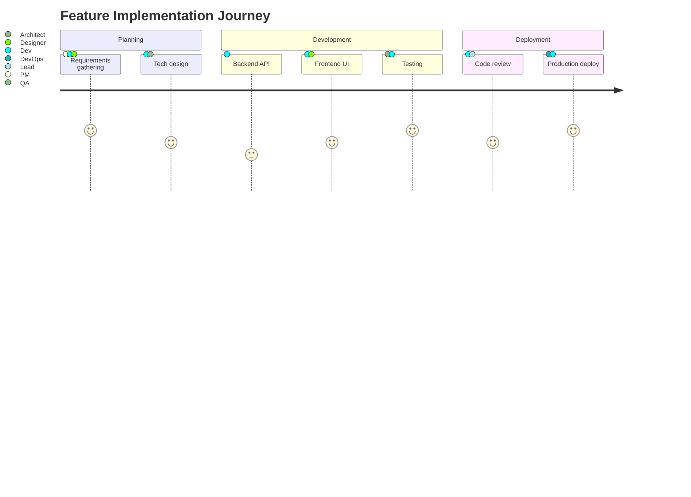

## Object-Oriented Design

**Payment System Classes:**
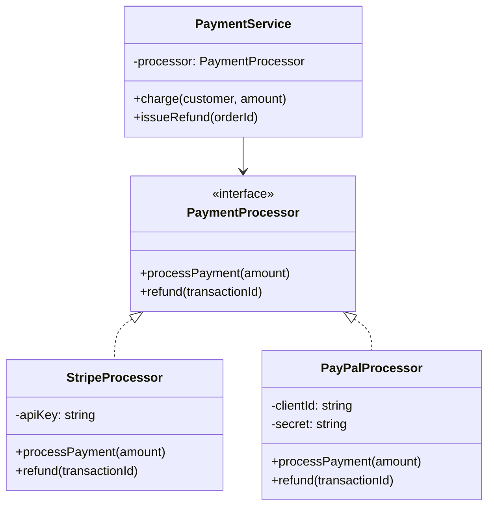

## CI/CD Pipeline

**Deployment Flow:**
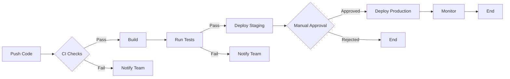

**Git Branching Strategy:**
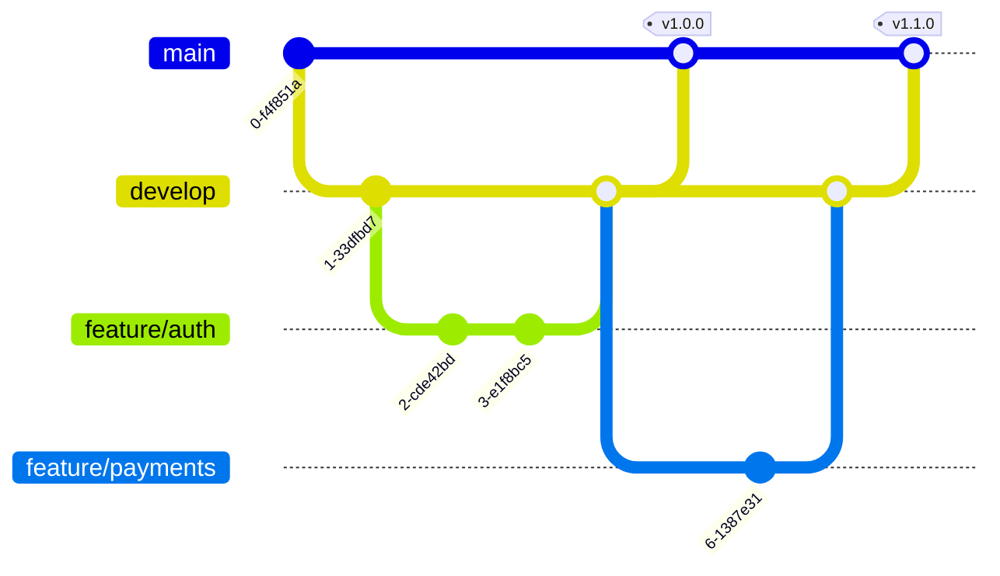

## User Experience

**Customer Onboarding:**
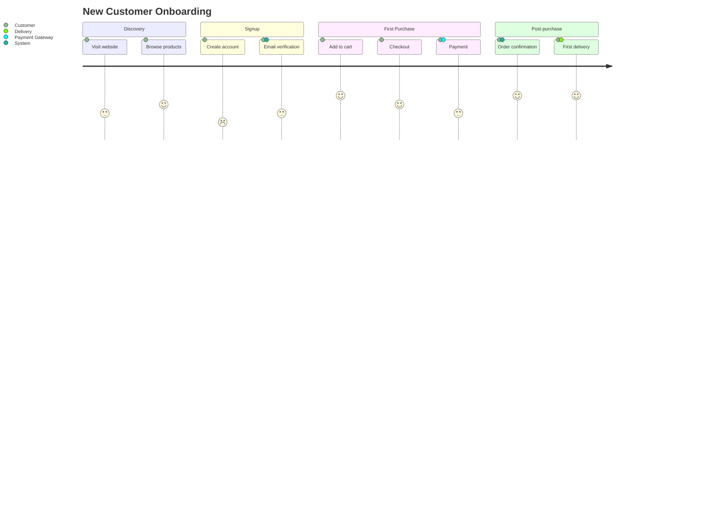

## Cloud Infrastructure

**AWS Architecture:**
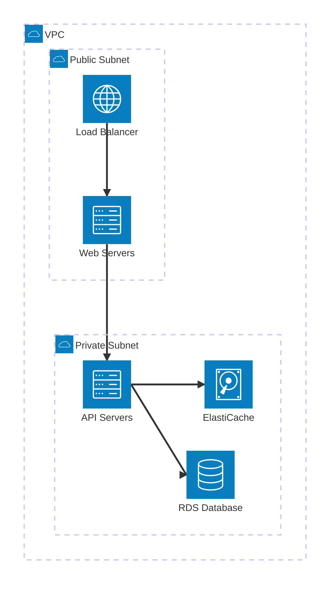

## Data Visualization

**Traffic Analysis:**
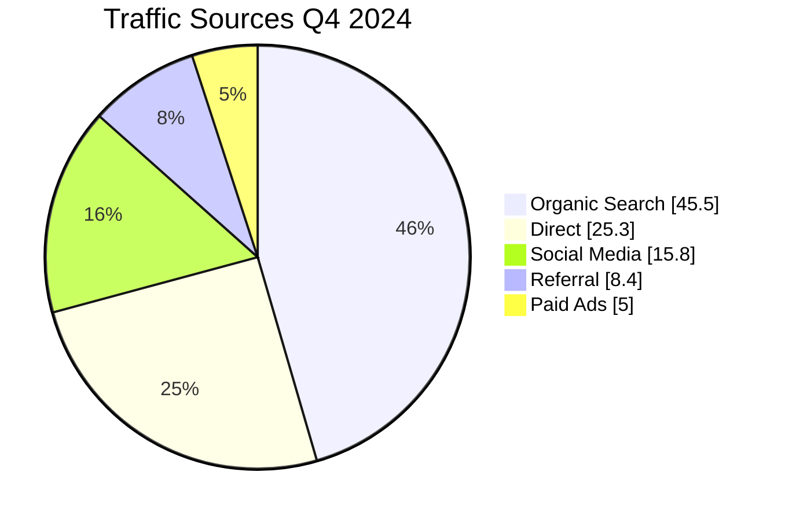

**Team Skills Assessment:**
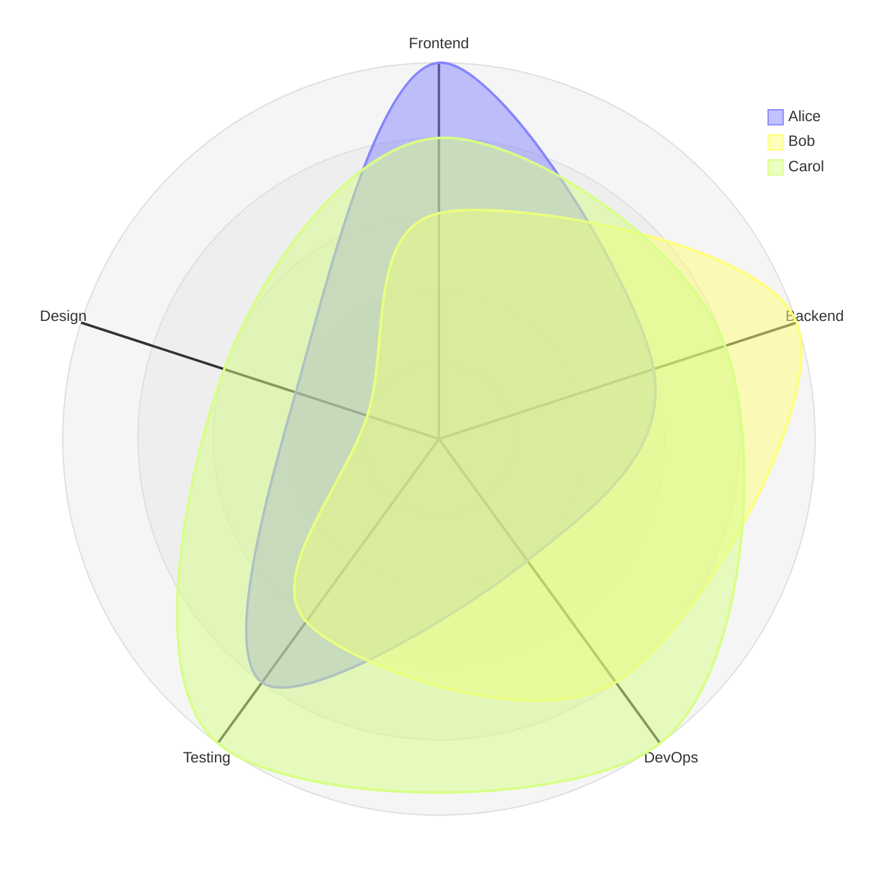

## Best Practices

**Naming Conventions:**
- Use descriptive node IDs: `userService` not `A`
- Clear labels: `[User Service]` not `[US]`
- Meaningful connections: `-->|authenticates|` not `-->`

**Styling Tips:**


**Security:**
Use `securityLevel: 'strict'` to prevent XSS in user-generated diagrams.
